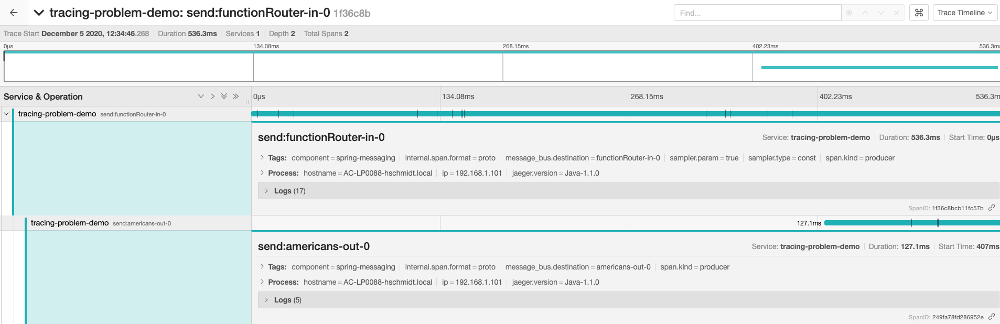
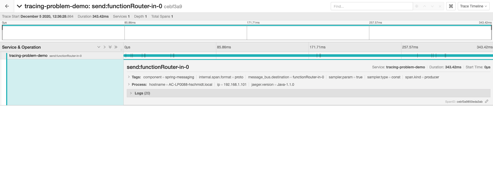
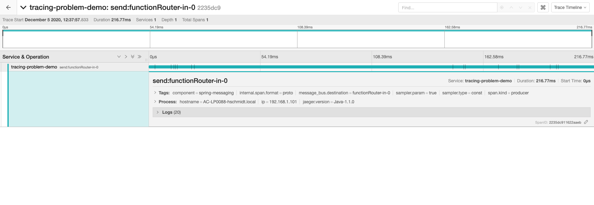

Tracing Problem with Spring Cloud Stream
===============
The goal of this repository is to show a problem that I am facing in order to trace my application
using Spring Cloud Stream and Jaeger.

1. [Sample Case](#sample-case)
2. [Event Routing](#event-routing)
3. [Tracing](#tracing)
4. [Problem](#problem)
5. [How to Run Locally](#how-to-run-locally)

## Sample case
The application receives messages in the topic `people` in a Kafka broker and, according to the country of the person,
it sends a message to another topic.

The person country is sent in a header with the key `country` and the following table shows the destination
topic according to the country.

Header value | Destination topic
------------ | ---------------- 
br           | brazilian-people
us           | american-people
de           | german-people

## Event Routing
In order to solve the described the problem, [Event Routing](https://docs.spring.io/spring-cloud-stream/docs/3.0.10.RELEASE/reference/html/spring-cloud-stream.html#_event_routing)
was configured in the project.

The property `spring.cloud.function.routing-expression` has the value `"new String(headers['country'])"`, so
according to the header `country` a consumer is called.

Three consumers were implemented in the package `com.henriquels25.cloudstream.tracingproblem.consumer`. The bean
name for each consumer is equal to the contry code sent in the header of the people topic.

Each consumer send a message to the topic of its country using functionality documented in [Routing FROM Consumer](https://docs.spring.io/spring-cloud-stream/docs/3.0.10.RELEASE/reference/html/spring-cloud-stream.html#_routing_from_consumer).

## Tracing
The library [java-spring-jaeger](https://github.com/opentracing-contrib/java-spring-jaeger) was added
in the project to enable tracing.

## Problem
The tracing is working well only with the `AmericanConsumer`, that uses a deprecated way of sending a message
to a specific destination. The following image shows the tracing for the consumer:


The Brazilian and German consumers only show the incoming message on Jaeger but not the outgoing message, as it can be
seen in the folowing images:

Brazilian tracing:

German tracing:


These are the techniques that each consumer is using to send messages:

Consumer            | Destination topic
------------------- | ---------------- 
`AmericanConsumer`  | [BinderAwareChannelResolver](https://docs.spring.io/spring-cloud-stream/docs/3.0.10.RELEASE/reference/html/spring-cloud-stream.html#_binderawarechannelresolver)
`BrazilianConsumer` | [spring.cloud.stream.sendto.destination](https://docs.spring.io/spring-cloud-stream/docs/3.0.10.RELEASE/reference/html/spring-cloud-stream.html#_spring_cloud_stream_sendto_destination)
`GermanConsumer`    | [StreamBridge](https://docs.spring.io/spring-cloud-stream/docs/3.0.10.RELEASE/reference/html/spring-cloud-stream.html#_using_streambridge)

The functionality is working well for the three consumers, the only problem is the tracing.

The same problem was observed when using [Spring Cloud Sleuth](https://spring.io/projects/spring-cloud-sleuth) 
and [Zipkin](https://zipkin.io/).

## How to Run Locally
There is a docker-compose that will setup Kafka and Jaeger. 

Run the following commands:

````shell script
$ docker-compose up -d
$ mvn spring-boot:run
````

After this, you can send messages to the topic `people` in the broker on the port `9092`. 
The JSON for the message has the following scheme:

```json
{
    "name": "person name"
}
```
The header `country` must be sent with the value `br`, `us` or `de`.

After sending the messages, you can go to `http://localhost:16686/` and look at the tracings
on Jaeger.

